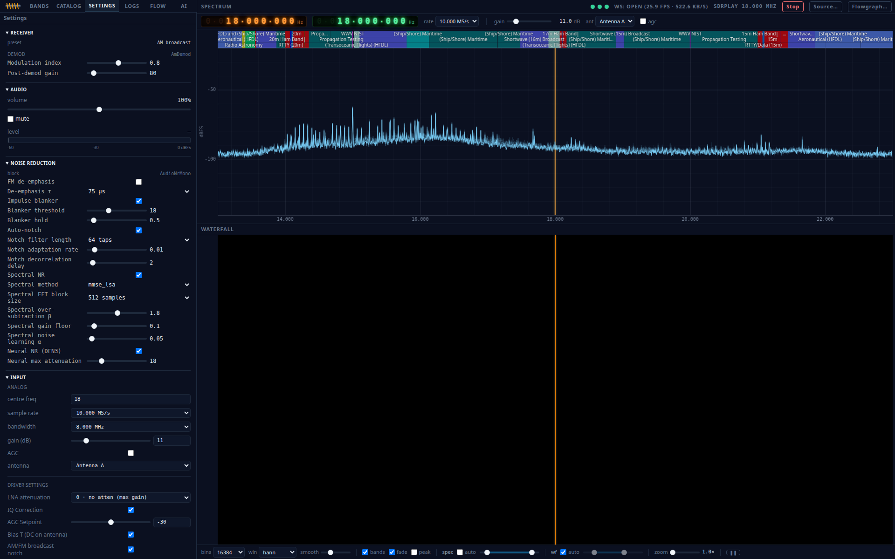
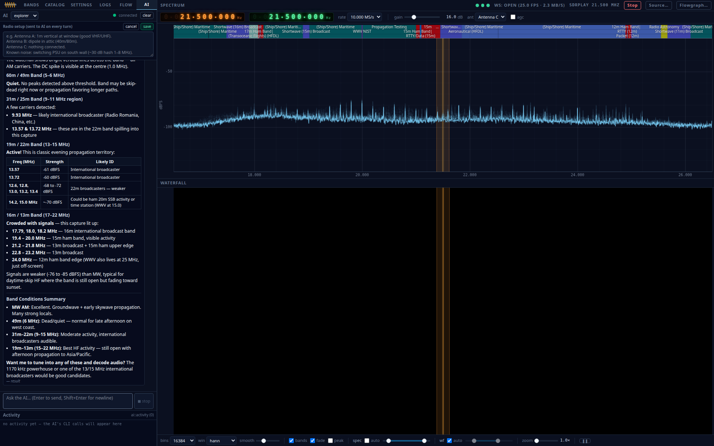
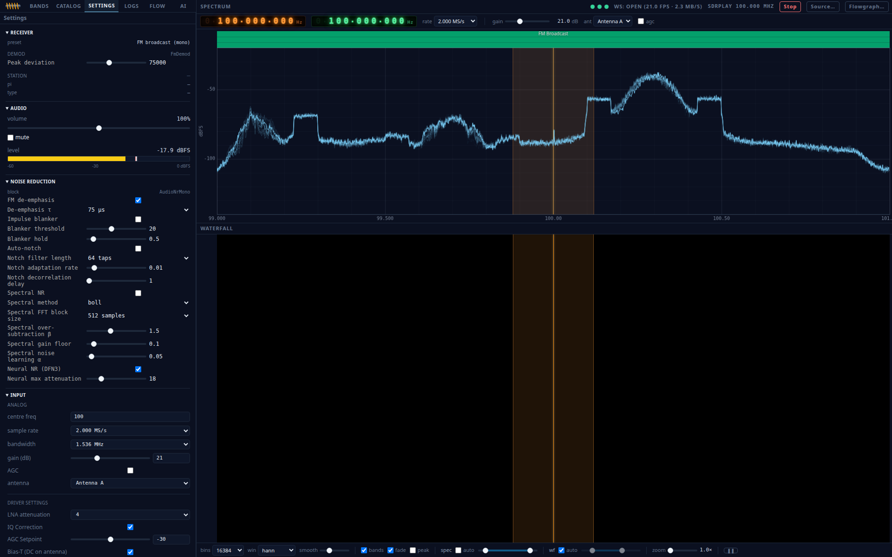
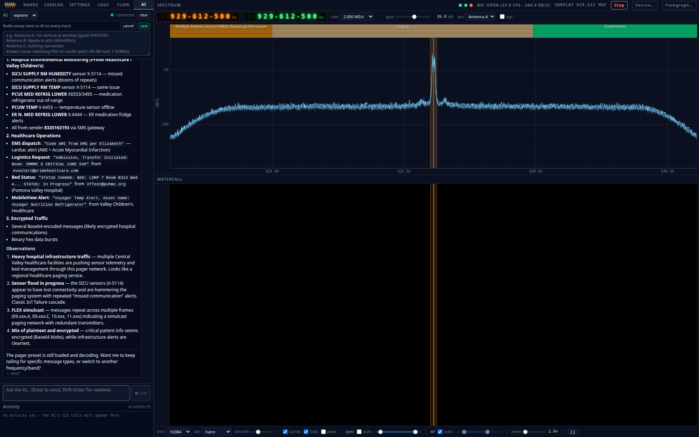

# Ferrite

**A browser-native SDR with a built-in AI operator.**

Point a small Rust daemon at your radio, open the URL on any machine on the
LAN, and you get a fluent spectrum/waterfall UI, thirty-plus ready-to-go
listening and decoder presets (analog, paging/packet/aviation, the full
fldigi keyboard-mode family, FT8/FT4/WSPR weak-signal — many decoding
right in the browser), mode-specific decoder panels (maps, tables, live
text), **a live speech-to-text transcript of whatever voice mode you're
listening to** (whisper.cpp running locally in the browser, no cloud),
and an optional Claude sidecar that finds signals, tunes the rig,
captures clips, and explains what it's hearing — all without leaving the
page.


## Vision

One app, in the browser, out of the box:

- **One binary, one URL.** A single Rust daemon serves the whole UI. No
  client install, no companion desktop app, no per-mode tool zoo — open
  the page and listen.
- **Every common mode built in.** Analog voice/music plus the digital
  decoders people actually reach for — ADS-B, AIS, APRS/packet,
  POCSAG/FLEX, RDS, EAS/SAME, DTMF, the weak-signal trio (FT8, FT4,
  WSPR), and the full vendored **fldigi** keyboard-mode family (RTTY,
  PSK31, CW, MT63, Olivia, Contestia, DominoEX, Throb, NAVTEX) with
  **RSID auto-detect** that hot-swaps to whatever mode shows up. All
  ship as presets — no recompiling, no external decoders as
  subprocesses.
- **An AI operator that drives the radio.** Optional, local-auth, and it
  uses the *same* control surface you do — it can find a signal, tune,
  swap presets, capture, and show you the spectrum it just looked at.
- **SoapySDR-native.** Any Soapy-supported radio works; device knobs are
  generated from the driver's own capability schema — adding a radio is
  zero frontend work.
- **Clean and mean on low-power hardware.** Tight Rust DSP, one block
  crate compiled native *and* to WASM (no second implementation), built
  to run on a Pi-class box driving a dongle, not a workstation.

## Screenshots

| | |
|---|---|
| Normal receive — busy HF, auto-contrast waterfall, band ribbon | The AI operator scanning AM/SW and reporting back inline |
|  |  |
| Per-device source dialog (auto-generated from Soapy schema) | Digital mode — AI-driven POCSAG/FLEX pager decode |
|  |  |

## Features

- **AI operator that drives the radio.** The `ferrite-ai` sidecar hands
  Claude a real SoapySDR rig via `ferrite-ctl`: tune, swap presets, change
  gain/AGC/antenna/DC-mode, capture FFT or audio, run a peak finder, and
  read PNG renders of what it just heard. Auth is your local Claude Code
  subscription — no API key in a file. Every command it runs surfaces in
  the activity panel.
- **MCP server.** `ferrite-ctl mcp` exposes the rig as a Model Context
  Protocol server over stdio — any MCP-enabled client (Claude Desktop,
  Claude Code CLI, the bundled sidecar) can drive a running `ferrited`
  with no shell-exec, no glue. Tools: `status`, `list_devices` /
  `list_presets`, `select_device` / `load_preset`, `tune` (dodge-aware),
  `start` / `stop`, `set_block_param`, `recent_decodes`, `view_snapshot`
  / `view_state`, `transcribe`, `reload_drivers`. See
  [docs/02-protocol.md](docs/02-protocol.md) for the wire surface +
  example Claude Desktop config.
- **One block crate, two compile targets.** Every DSP unit (channelizer,
  FM/AM/SSB demod, audio shaper, EAS/POCSAG/RDS/ADS-B/AIS/FT8/WSPR/fldigi
  decoders, …) is one Rust source file that builds native into `ferrited`
  *and* into the browser's WASM worker. No second implementation, no
  drift. fldigi is C++/STL with no clean wasm path, so it rides a
  link-vs-bridge design: the Rust wasm declares the modem ABI as
  imports, satisfied at runtime by a sibling Emscripten module.
- **Decode on the server *or* in the browser — flip it live.** Every
  decoder block is placement-`Either`; the demod-placement chip moves
  it node↔browser at runtime with no preset edit and no reload. A
  unified event transport means decoded text/spots reach the UI
  identically whichever side ran it — offload a CPU-heavy FT8/WSPR
  decode onto each listener's browser, or keep it on the box.
- **Mode-specific decoder panels.** "Advanced" swaps the wide
  FFT/waterfall column for a mode view: FT8/FT4/WSPR decode table +
  station map, ADS-B aircraft map, APRS station map + packet console,
  and a live fldigi text console (mode badge tracks RSID switches).
- **In-browser voice transcription.** Tap *Main → Transcript* on any
  analog-voice preset (WBFM / NBFM / AM / SSB) and the post-demod PCM
  starts feeding [whisper.cpp](https://github.com/ggerganov/whisper.cpp)
  compiled to WASM — fully local, no network, no API key, no cloud.
  Ham-vocabulary prompt + post-processing scrubs whisper's classic
  short-clip tail-loop and call-sign mishearings;
  [tinydiarize](https://github.com/akashmjn/tinydiarize) flags
  speaker turns when you load the `tdrz` model so a two-station QSO
  breaks into separate paragraphs. Live rolling transcript with
  copy / save controls; the AI sidecar reads the same store so you
  can ask it about what just got said.
- **JSON-authored flowgraphs.** A mode is a flowgraph file in
  [`flowgraphs/`](flowgraphs/) plus optional blocks — no UI work, no
  server recompile. Thirty-plus ship in the box.
- **World-class analog chain.** Envelope AM (offset-immune), limiter +
  discriminator FM, post-demod `AudioShaper` (DC block + brick-wall LPF:
  15 kHz WBFM mono / 3.4 kHz NBFM / 5 kHz AM), pilot-PLL stereo with
  blend, and a tunable 5-stage NR (deemph → blanker → notch → spectral
  MMSE-LSA → DFN3 neural), lean by default.
- **Band-plan-aware tuning, with a DC-dodge for zero-IF rigs.** The
  active demod + a US allocation overlay derive step/snap; ↑/↓ step,
  ←/→ pan, wheel zoom-at-cursor on the spectrum. Tuning gestures on
  any FFT/waterfall pane: single-click = fine-tune the VFO (channel
  shift only, source LO parked), double-click = re-acquire (full
  `/api/tune` — the server may move the source LO and applies the
  per-driver DC-spike dodge so HackRF-class zero-IF radios don't paint
  the carrier on top of the signal), drag = live fine-tune. The wide
  panes' axis is the source LO; the narrow panes follow the VFO. A
  cross-pane hover line previews where the next click would tune.
- **Auto-contrast waterfall.** P5/P98 of recent FFT rows tracked
  client-side and stretched to the palette; manual slider for
  pixel-peeping.
- **Live captures that don't disrupt the session.** Side-tee the FFT or
  demod audio mid-session; render PNG strips with `tools/fft_to_png.py`;
  pull peaks with `tools/fft_peaks.py`. The AI uses the same tools.
- **Signal catalog + band ribbon.** Sigidwiki-derived metadata,
  searchable, one-click tune; US band-allocation ribbon under the
  spectrum.
- **Replay is a first-class source.** `--source-type FileIqSource
  --source-path foo.iq` is a drop-in for a dongle. Every E2E test runs
  this way; so can you.

## Install

Binary packages for Debian 12 / 13, Ubuntu 24.04, and Fedora 40 across
amd64 / arm64 / riscv64 (`packaging/run_matrix.sh`):

```bash
# Debian / Ubuntu
sudo apt install ./ferrite_0.9.0_amd64.deb
# Fedora
sudo dnf install ./ferrite-0.9.0-1.fc40.x86_64.rpm

sudo systemctl enable --now ferrited
xdg-open http://localhost:10001
```

The package wires `/usr/bin/ferrited` to launch with the bundled SoapySDR
+ driver plugins and the static web bundle — no env exports. `ferrited`
listens on `0.0.0.0:10001` (REST + WS, plain HTTP on loopback); remote
access is your tunnel problem (same posture as KiwiSDR / OpenWebRX). See
[docs/07-deploy.md](docs/07-deploy.md).

**SDRplay** needs sdrplay.com's closed-source API daemon installed and
`systemctl enable --now sdrplay` before the plugin is picked up.
**RTL-SDR**: the package drops a udev rule + DVB-driver blacklist; if a
fresh dongle isn't seen, replug or `sudo modprobe -r dvb_usb_rtl28xxu`.
**In-process recovery**: if a driver wedges inside `ferrited` after it
started (external `SoapySDRUtil --find` works, ours hangs / misses a
device), the Source dialog's **Reload** button (or `POST
/api/devices/reload`) calls `SoapySDR_unloadModules` +
`SoapySDR_loadModules` and re-probes. Pipeline must be stopped first.
For SDRplay specifically the wedge is usually in the daemon, not the
in-process module — `sudo systemctl restart sdrplay` is the right
hammer there.

## First five minutes

1. Open `http://localhost:10001`.
2. Click **Source…** in the top bar, pick your device. The compact
   dialog is the SDR-management surface — one-line-per-device list,
   driver/rx chips; the rare alternatives (Tone, File, JSON) live
   behind a collapsed **Other sources** disclosure. If a previously
   working SDR has wedged in-process (external `SoapySDRUtil --find`
   sees it but ours doesn't), **Reload** at the top of the device list
   tears down + re-loads every driver module without restarting
   `ferrited`. Driver-specific knobs live in the lower **Settings**
   panel — auto-generated from the device's Soapy schema.
3. Open the **catalog** (left sidebar). *NOAA Weather Radio* and *FM
   Broadcast* are the cheapest first listens; the thumbnail shows what the
   waterfall should look like on a real signal.
4. **Listen** — audio routes through an AudioWorklet.
5. **Tune.** On any FFT or waterfall pane: single-click = fine-tune
   the VFO; double-click = re-acquire (moves the source LO with the
   per-driver DC-spike dodge); drag = live fine-tune; wheel = zoom at
   cursor; ↑/↓ = step. The orange Nixie also commits to whatever
   frequency you type.
6. **Transcribe.** Flip the top-bar **Main → Transcript** on any voice
   preset (WBFM / NBFM / AM / SSB) and a rolling, locally-run
   whisper.cpp transcript starts populating in the main pane. Speaker
   changes break into separate paragraphs (with the `tdrz` model);
   ham-vocabulary post-processing keeps the call signs honest.
7. Or open the **AI** tab and ask: *"find a strong FM station and identify
   it"*, *"scan 144–148 MHz for activity"*, *"capture 10 s of 162.475 MHz
   and render the FFT"*.

## Modes & test maturity

Thirty-plus shipped flowgraph presets. **Coverage** legend: **fixture** =
e2e replays a real/known IQ or audio capture and asserts decoded output;
**loopback** = synthetic modulate→demod→analyze e2e; **contract** =
compose/split/instantiate + chunk-invariance/glitch/rate-drift guards;
**browser** = the decoder is exercised through the wasm runtime in a
browser-path e2e (not just node-side).

| Mode | Preset(s) | Kind | Coverage |
|---|---|---|---|
| WBFM broadcast (+RDS) | `wbfm` | analog | fixture (`wbfm_e2e`, `rds_e2e`) + loopback + contract |
| WBFM stereo | `wbfm_stereo` | analog | loopback (`analog_audio_nr_e2e`) + contract |
| AM broadcast / SW / air | `wbam` | analog | fixture (`am_e2e`, real sigidwiki IQ) + loopback + contract |
| NBFM voice | `nbfm` | analog | loopback (`audio_modes_e2e`) + contract |
| SSB (USB / LSB) | `usb`, `lsb` | analog | loopback (`audio_modes_e2e`) |
| CW / Morse (multimon) | `cw`, `morse-e2e` | digital | fixture (`morse_e2e`) |
| ADS-B / Mode S | `adsb` | digital | fixture (`adsb_e2e`, dump1090) |
| AIS | `ais` | digital | fixture (`ais_e2e`, rtl-ais) |
| AX.25 packet / APRS | `packet`, `packet-debug` | digital | fixture (`packet_e2e`) |
| POCSAG / FLEX paging | `pager` | digital | fixture (`pager_e2e`, multimon-ng) |
| FT8 / FT4 | `ft8`, `ft4` | digital | fixture (`ft8_e2e`, ft8_lib) + **browser** (`ft8BrowserE2E`) |
| WSPR | `wspr` | digital | fixture (`wspr_e2e`, wsprd → `K1JT FN20 20`) + **browser** (`wsprBrowserE2E`) |
| RTTY / PSK31 / CW / MT63 / Olivia / Contestia / DominoEX / Throb / NAVTEX | `rtty`, `psk31`, `mt63`, `throb`, `dominoex`, `contestia`, `olivia`, `navtex` | digital (fldigi) | fixture (`fldigi_modes_e2e`, real samples) + loopback (`fldigi_e2e`) + **browser** (`fldigiBrowserE2E`) |
| RSID auto-mode | `rsid` | digital (fldigi) | fixture (`fldigi_auto_e2e` — RSID hot-swap + decode) |
| Combined HF digital | `digital-hf-20m` | digital | contract |
| NOAA WX + EAS/SAME | `nwr` | hazard | fixture (`eas_e2e`) |
| DTMF | `dtmf-e2e` | tones | fixture (`dtmf_e2e`, `dtmf_cross_env`) |
| rtl_433 ISM | `rtl433-433` | digital | fixture (`rtl433_e2e`, real Acurite CU8) |
| Capture / record | `capture_fm`, `capture-aprs`, `capture-pager`, `fm-audio-record`, `am-audio-record` | utility | smoke (`record_smoke`) |

Cross-cutting audio correctness is gated by `chunk_invariance_e2e`
(no per-tick clicks), `glitch_e2e` (no discontinuities through the
demod→shaper→resamp chain), and `shipped_audio_presets` (every audio
preset composes/splits + is rate-drift-free). See
[docs/05-testing.md](docs/05-testing.md).

## Vendored libraries

Heavy decoders are wrapped as native Rust crates (regression-tested, not
subprocesses) under [`blocks/native/`](blocks/native/). Each builds native
*and* to WASM from the same vendored sources; per-crate `VENDOR.md` records
the pinned commit + resync steps.

| Library | Upstream | License | What we modified |
|---|---|---|---|
| liquid-dsp | [jgaeddert/liquid-dsp](https://github.com/jgaeddert/liquid-dsp) | MIT | Vendored `include/` + `src/` minus `*.test.c`, `*.benchmark.c`, and all SIMD variants (portable C only). Our `build.rs` is the authoritative source list (replaces upstream CMake). |
| multimon-ng | [EliasOenal/multimon-ng](https://github.com/EliasOenal/multimon-ng) | GPL-2.0-or-later | Dropped `unixinput.c` (`main()`/stdio — replaced by `shim/multimon_shim.c`), `gen_*.c` modulators, SDL scope. Trimmed `test/demo/example/unsupported`. Library-ized for in-process decode. |
| dump1090 (antirez classic) | [antirez/dump1090](https://github.com/antirez/dump1090) | BSD-2-Clause | None trimmed; single-file `dump1090.c` + `anet.c` wrapped via a shim against the one global `Modes` struct (chose classic over FlightAware for a tractable wrap). |
| ft8_lib | [kgoba/ft8_lib](https://github.com/kgoba/ft8_lib) | MIT | Streaming-decoder subset only (`ft8/` coding + `common/monitor` + bundled `kiss_fft`); upstream CLI demo kept as reference, not compiled. |
| aisdecoder (rtl-ais) | [dgiardini/rtl-ais](https://github.com/dgiardini/rtl-ais) | GPL-2.0-or-later | Only the `aisdecoder/` subdir vendored; upstream's `rtl_ais.c` RF pipeline + TCP/UDP NMEA bridge dropped (Ferrite's own Channelizer/FmDemod/Resamp feed it). |
| rtl_433 | [merbanan/rtl_433](https://github.com/merbanan/rtl_433) | GPL-2.0-or-later | Dropped `rtl_433.c` (`main()`/CLI) and `sdr.c` (device I/O) for a `shim/` that wires the C decoder to the `Block` interface. Trimmed `tests/examples/docs/man/cmake/conf/debian/getopt`. |
| fldigi (modem cores) | [w1hkj/fldigi](https://github.com/w1hkj/fldigi) v4.2.11 | GPL-3.0-or-later | Curated RX-only modem cores (RTTY/PSK/CW/MT63/Olivia/Contestia/DominoEX/Throb/NAVTEX + RSID) behind a narrow C ABI. ~21 replacement `shim/` headers strip FLTK/UI/TX. **Native**: static C++ link. **wasm32**: link-vs-bridge — `build.rs` compiles nothing, the ABI is left as wasm imports satisfied by a sibling Emscripten module (`emscripten/build.sh`, emsdk). |
| wsprd | [Guenael/rtlsdr-wsprd](https://github.com/Guenael/rtlsdr-wsprd) | GPL-3.0 | WSJT-X WSPR decode core (K1JT/K9AN) only — one 120 s window in, spots out. FFTW shimmed to bundled `kiss_fft` so it cross-compiles to wasm32 with the rest. |

Vendored data: the spectrum band-allocation overlay
(`web/src/lib/presets/bandplan-usa.json`) is Arrin Clark (KN1E)'s
[SDR-Band-Plans](https://github.com/Arrin-KN1E/SDR-Band-Plans), **CC0**,
imported verbatim (one-file copy; the alpha channel is stripped at load).
Natural Earth map polygons (public domain) back the station maps. fldigi
and FT8/FT4/WSPR all decode browser-side as well as on the server (see
[docs/01-architecture.md](docs/01-architecture.md)).

## Hardware

Anything SoapySDR supports works in principle. Tested:

| Driver | Hardware | Notes |
|---|---|---|
| `rtlsdr` | RTL2832U dongles | Most common starter SDR |
| `sdrplay` | RSPduo, RSPdx | Closed-source API daemon required |
| `hackrf` | HackRF One | RX only (no TX) |
| `airspy` | Airspy R2, Airspy HF+ | |
| `bladerf` | BladeRF | |
| `plutosdr` | ADALM-PLUTO | |
| `uhd` | USRP | `libuhd-dev` + rebuilt Soapy plugins |
| `file` | IQ replay | Built-in `FileIqSource` — any captured `.iq` |

Per-device knobs (RTL-SDR bias-tee / offset-tune, SDRplay notches /
LNAstate / IFGR, RSPduo tuner select) surface in the source dialog
straight from each driver's Soapy `getSettingInfo` — new driver, zero
frontend work.

## Build from source

Full sequence in [docs/06-build.md](docs/06-build.md). Short version on a
clean Ubuntu 24.04:

```bash
# 1. system deps
sudo apt install -y build-essential pkg-config curl git cmake clang lld \
  wasi-libc librtlsdr-dev libhackrf-dev libairspy-dev libairspyhf-dev \
  libbladerf-dev libiio-dev libad9361-dev

# 2. toolchains
curl --proto '=https' --tlsv1.2 -sSf https://sh.rustup.rs | sh
rustup target add wasm32-unknown-unknown && cargo install wasm-pack
curl -fsSL https://deb.nodesource.com/setup_20.x | sudo -E bash -
sudo apt install -y nodejs && sudo corepack enable
corepack prepare pnpm@10.33.0 --activate

# 3. SoapySDR local prefix
./scripts/build-soapysdr.sh && source soapysdr/env.sh

# 4. build everything (cargo release + WASM + web bundle)
pnpm install && ./build.sh

# 5. dev loop (ferrited + vite HMR + ferrite-ai)
./run.sh
```

Dev UI with HMR at <http://localhost:10000>; production bundle served by
`ferrited` at <http://localhost:10001>. Any change to a `blocks/` or
`runtime/` crate needs **both** `cargo build` *and* `pnpm wasm:build`
(`./build.sh` does both) — a native-only rebuild leaves the browser half
stale.

## Running the components

### Scripts (the normal path)

| Script | Does |
|---|---|
| `./build.sh` | Sources `soapysdr/env.sh`; `cargo build --release` (workspace) + `pnpm install --frozen-lockfile` + `pnpm --filter @ferrite/web build` (WASM + web bundle). Refuses if `ferrited` is running (`BUILD_FORCE=1` overrides). Outputs `target/release/ferrited`, `web/build/`, `web/src/lib/wasm/`. |
| `./run.sh` | Foreground dev stack: `ferrited` on `0.0.0.0:10001`, `ferrite-ai` on `:10002`, vite (HTTPS) on `0.0.0.0:10000`. Sources `soapysdr/env.sh`; needs `./build.sh` first. Ctrl-C stops all three. |
| `./stop.sh [--no-sdr]` | Kills `ferrited` / `ferrite-ai` / vite by port and restarts the SDRplay API service (`--no-sdr` skips the SDR recycle). Run before `build.sh`/`run.sh` if a previous `ferrited` is holding the radio. |

### Standalone (run a piece by hand)

```bash
# ferrited — REST+WS daemon. `--flowgraph` is required; source is a
# harmless SineSource until set via the UI / ferrite-ctl.
source soapysdr/env.sh
cargo run -p ferrited --release -- \
  --flowgraph flowgraphs/wbfm.json --bind 0.0.0.0:10001 --start
# (or the built binary: ./target/release/ferrited --flowgraph … )

# vite dev server — proxies /api and /ws to ferrited; needs WASM built
# once (`pnpm wasm:build`, or ./build.sh).
cd web && FERRITE_HTTPS=1 pnpm dev --host 0.0.0.0 --port 10000

# AI sidecar — ferrited reverse-proxies /ws/chat to it. Needs `claude`
# logged in once on this host (subscription auth, no API key).
cd tools/ferrite-ai && npm install && FERRITE_AI_PORT=10002 npm start
```

### `ferrited` CLI args

`--bind <ADDR>` (default `0.0.0.0:8088`) · `--flowgraph <PATH>`
(required) · `--source <PATH>` (SourceConfig JSON) **or** inline
`--source-type` (default `SineSource`) `--source-args` `--antenna`
`--gain-db` `--agc` `--source-bandwidth-hz` `--source-path` `--loop` ·
`--start` (spawn pipeline immediately) · `--presets-dir <PATH>` ·
`--tick-period-us <N>` (default 400) · `--run-for-secs <SECS>`
(headless, implies `--start`). Diagnostics that exit without serving:
`--list-devices`, `--probe-device <ARGS>`, `--probe-all`, `--read-all`
(`--read-secs`, `--read-device`, `--read-rate-hz`).

### `ferrite-ctl` — drive a running `ferrited`

Global: `--connect <BASE>` (default `http://127.0.0.1:10001`) · `--json`
(machine output; the AI uses this) · `--timeout <S>` · `--note "<text>"`
(tags the request `X-Ferrite-Note`, shown in the UI activity log).

Subcommands: `device …` · `preset …` · `tune <freq> [--bw --rate
--gain]` (accepts `99.5M`/`915k`) · `param <block> key=value…` ·
`start` · `stop` · `status` · `capture {iq|audio|fft} …` ·
`tail [--category]` · `decoder {recent|tail}` · `view <pane>` (snapshot
a live spectrum/waterfall canvas to PNG).

```bash
cargo run -p ferrite-ctl -- status
cargo run -p ferrite-ctl -- --note "find FM" tune 99.5M --gain 30
```

### Packaging

`packaging/run_matrix.sh` builds the `.deb`/`.rpm` matrix via Docker
buildx (`Dockerfile.deb` / `Dockerfile.rpm`); the web bundle is built
once on the host and tarballed in. Cross-arch rows (arm64, riscv64) need
`qemu-user-static` + `binfmt_misc`:

```bash
sudo apt install qemu-user-static binfmt-support docker-buildx
docker run --privileged --rm tonistiigi/binfmt --install all
packaging/run_matrix.sh
```

The installed `/usr/bin/ferrited` is the `packaging/ferrited` wrapper —
it exports `LD_LIBRARY_PATH` / `SOAPY_SDR_PLUGIN_PATH` /
`FERRITE_STATIC_ROOT` for the bundled SoapySDR + web assets, then execs
`/usr/lib/ferrite/ferrited "$@"` (so all the CLI args above still apply
under systemd).

## Tests

```bash
cargo test --workspace            # server + runtime + blocks (real fixtures, no mocks)
pnpm --filter @ferrite/web test   # web unit tests
pnpm --filter @ferrite/web check  # type-check
cargo clippy --workspace -- -D warnings
pnpm -r lint
```

The integration suite boots a real `ferrited`, replays known IQ fixtures,
and asserts decoder output — same binary as production. Pre-commit
(lefthook, installed by `pnpm install`) runs fmt/lint/check on staged
files. Details in [docs/05-testing.md](docs/05-testing.md).

## Status

**0.9.0 — pre-release.** User-facing surface is feature-complete and
stable for daily listening. The mode-specific decoder panels (FT8/FT4/
WSPR table+map, ADS-B map, APRS map+console, fldigi text console) and
browser-side decode with the live node↔browser swap have **shipped**.
Before 1.0: broader `rtl_433` device coverage; `Mode A/C`; sigidwiki
sample/thumbnail backfill for the newest fldigi presets. Out of scope
for 1.0 by design: multi-listener/multi-device, auth (LAN-trust),
transmit, mobile-first UI, DMR/DSD (AMBE patent).

Live tally in [docs/08-roadmap.md](docs/08-roadmap.md);
[docs/12-shipped-vs-planned.md](docs/12-shipped-vs-planned.md) tracks
deltas against the master plan.

## Documentation

- [00 — Context and goals](docs/00-context.md)
- [01 — Architecture](docs/01-architecture.md)
- [02 — Control API & WS frame format](docs/02-protocol.md)
- [03 — Block system](docs/03-blocks.md)
- [04 — Flowgraph JSON schema](docs/04-flowgraphs.md)
- [05 — Testing strategy](docs/05-testing.md)
- [06 — Build & dev setup](docs/06-build.md)
- [07 — Deployment](docs/07-deploy.md)
- [08 — Roadmap](docs/08-roadmap.md)
- [09 — Decision log](docs/09-decisions.md)
- [10 — Commit-level history](docs/10-commits.md)
- [11 — BrowSDR-inspired follow-ups](docs/11-browsdr-inspired-plan.md)
- [12 — Shipped vs. planned](docs/12-shipped-vs-planned.md)
- [Decoder roadmap](docs/decoder-roadmap/README.md) — phased decoder plan
- [CONTRIBUTING.md](CONTRIBUTING.md)

## License

GPL-3.0-or-later. See [LICENSE](LICENSE). Vendored decoders under
[`blocks/native/`](blocks/native/) retain their upstream licenses (see
the [vendored libraries](#vendored-libraries) table); all are
GPL-3.0-compatible.
