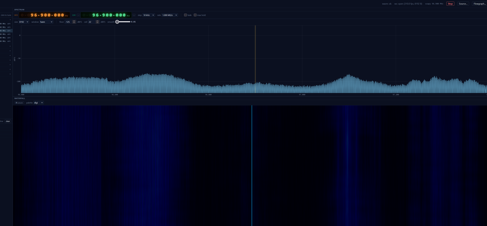

# Ferrite

**A browser-native SDR with a built-in AI operator.**

Point a small Rust daemon at your radio, open the URL on any machine on the
LAN, and you get a fluent spectrum/waterfall UI, twenty-one ready-to-go
listening and decoder presets, and an optional Claude sidecar that can find
signals, tune the rig, capture clips, and explain what it's hearing — all
without leaving the page.



## What makes it different

- **AI operator that drives the radio.** The optional `ferrite-ai` sidecar
  hands a chat panel a real SoapySDR rig: it can tune, swap presets, change
  gain/AGC/antenna, take spectrum captures, run a peak finder, and read PNG
  renders of what it just heard. Auth is your local Claude Code subscription
  — no API key in a config file. See [the AI operator](#the-ai-operator).
- **One block crate, two compile targets.** Every DSP unit (channelizer, FM
  demod, EAS / POCSAG / RDS / ADS-B / AIS / FT8 decoders, …) is one Rust
  source file that builds native into `ferrited` *and* into a WASM bundle
  the browser worker loads. No second implementation, no drift.
- **JSON-authored flowgraphs.** Adding a new mode is a flowgraph file
  ([`flowgraphs/`](flowgraphs/)) plus optional blocks. No UI work, no
  recompiling the server. Twenty-one ship in the box (see
  [decoders](#what-it-decodes)).
- **Live captures that don't disrupt your session.** Tee the FFT bin stream
  or the demodulated audio to a `.bin` + JSON sidecar mid-session; render
  them to PNG strips with `tools/fft_to_png.py`; pull peaks out with
  `tools/fft_peaks.py`. The AI uses the same tools the human does.
- **Auto-contrast waterfall.** P5/P98 of recent FFT rows is tracked
  client-side and stretched into the palette so noise sits at dark blue and
  carriers reach white regardless of band level. Manual contrast slider for
  pixel-peeping.
- **5-stage audio noise reduction.** De-emphasis → impulse blanker →
  adaptive notch → spectral subtraction (MMSE-LSA / Wiener) → DFN3 neural
  denoiser. Per-preset tuning so AM doesn't get the WBFM stack.
- **Signal catalog with thumbnails.** Sigidwiki-derived metadata, searchable,
  one-click tune. Plus a US band-allocation ribbon under the spectrum.
- **Replay is a first-class source.** `--source-type FileIqSource
  --source-path foo.iq` is a drop-in for an RTL-SDR. Every E2E test runs
  this way; so can you.

## Install

Binary packages for Debian 12 / 13, Ubuntu 24.04, and Fedora 40 across
amd64 / arm64 / riscv64 are built from a single matrix script
(`packaging/run_matrix.sh`). Pick the row that matches your machine:

```bash
# Debian / Ubuntu
sudo apt install ./ferrite_0.9.0_amd64.deb

# Fedora
sudo dnf install ./ferrite-0.9.0-1.fc40.x86_64.rpm
```

The package wires `/usr/bin/ferrited` to launch with the bundled SoapySDR +
driver plugins and the static web bundle pre-configured — no env exports
needed. Then:

```bash
sudo systemctl enable --now ferrited
xdg-open http://localhost:10001
```

The `ferrited` unit listens on `0.0.0.0:10001` (REST + WS, plain HTTP on
loopback). Remote access is your tunnel problem — same posture as KiwiSDR
or OpenWebRX on personal hardware. See
[docs/07-deploy.md](docs/07-deploy.md) for systemd, reverse-proxy, and
HTTPS notes.

### SDRplay extra step

The SDRplay Soapy plugin needs sdrplay.com's closed-source API daemon
installed first:

```bash
# Download the .run installer from sdrplay.com, then:
sudo systemctl enable --now sdrplay
```

The Ferrite package picks the plugin up automatically once the daemon is
running.

### RTL-SDR udev + blacklist

Ship-installed but worth knowing — the package drops a udev rule and a
DVB-driver blacklist into `/etc/`. If a freshly-plugged dongle isn't seen,
unplug/replug or `sudo modprobe -r dvb_usb_rtl28xxu`.

## First five minutes

1. Open `http://localhost:10001`.
2. Click the **SDR** picker in the top bar, pick your device, choose an
   antenna and sample rate. The dialog is auto-generated from the device's
   Soapy capability schema, so SDRplay-specific notches and RTL-SDR
   direct-sample switches both show up.
3. Click the **catalog** in the left sidebar. Pick something — *NOAA
   Weather Radio* and *FM Broadcast* are the cheapest first listens. The
   right thumbnail tells you what the waterfall should look like when you
   hit a real signal.
4. **Listen.** Audio routes through an AudioWorklet, no buffering issues.
5. Click anywhere on the spectrum to retune. Drag the orange line on the
   waterfall to set a per-VFO offset inside the wideband window.

If you want the AI to drive instead of you: open the **AI** tab on the
right and tell it what you want. *"find a strong FM station and identify
it"*, *"scan 144-148 MHz for activity"*, *"capture 10 s of 162.475 MHz
and render the FFT to PNG"* all work.

## The AI operator

`ferrite-ai` is a small Node sidecar that wraps the
[Claude Agent SDK](https://docs.anthropic.com/claude/docs/agent-sdk) and
gives Claude one tool: a Bash shell with `ferrite-ctl` on the PATH.
`ferrite-ctl` is a thin Rust CLI that drives `ferrited` via its REST API —
list devices, set source, change preset, tune, change gain, capture FFT,
capture audio. The AI also gets `fft_to_png.py` and `fft_peaks.py` so it
can *see* what it just captured.

**What the operator gets out of it.** A radio that knows what it is. The
prompt is briefed on antennas (per-device, per-band, from a per-driver
operator-notes JSON the user can edit), AGC quirks, frequency conventions
(centre-tune vs offset), and the full block roster. Ask *"is anything
interesting on HF right now"* and it'll pick an antenna, set a sample
rate, scan in chunks, render PNGs, and tell you what it found — with the
spectrum strips inline in chat.

**Auth.** No API key in a config file. The sidecar inherits the local
Claude Code login from your `claude` CLI session — subscription billing.
Run `claude` once on the server to sign in, and `ferrite-ai` picks it up.

**Reverse-log.** Every command the AI runs is tagged with an
`X-Ferrite-Command` header and surfaces in the activity panel under
`ai::activity`, so you can watch what it's doing in real time.

**Setup textbox.** A free-form "describe your radio setup" field in the
AI panel gets merged into every prompt. Use it to tell the AI *"Antenna A
is a 40 m end-fed, Antenna B is a discone for VHF"* — it'll route around
your physical layout.

The sidecar is **optional**. Disable it in the systemd dropin and the UI
hides the chat tab.

## What it decodes

Twenty-one shipped flowgraph presets, grouped by use:

| Group | Presets | Notes |
| --- | --- | --- |
| Voice / music | `wbfm`, `wbfm_stereo`, `wbam`, `nbfm`, `lsb`, `usb`, `cw` | Full audio NR stack (deemph / blanker / notch / spectral / DFN3 neural), per-preset tuned |
| Digital — telemetry | `adsb`, `ais`, `packet`, `packet-debug` | dump1090 Mode S + rtl-ais NMEA + AX.25 packet (APRS, BBS, AMSAT digipeaters) |
| Digital — paging | `pager` | multimon-ng POCSAG (512/1200/2400) + FLEX |
| Digital — weak-signal | `ft8` | kgoba ft8_lib, runs through the same channelizer/decimator chain |
| Digital — tones | `dtmf-e2e`, `morse-e2e`, `cw` | End-to-end canaries used by CI; also useful as live decoders |
| Weather / hazard | `nwr` | NOAA Weather Radio + EAS / SAME header decode |
| RDS | (in `wbfm` / `wbfm_stereo`) | Station name, alt-freq, programme type, full PI/PS/RT |
| Capture / record | `capture_fm`, `capture-aprs`, `capture-pager`, `fm-audio-record`, `am-audio-record` | Side-tee the IQ or audio without disrupting the live demod. `capture-aprs` tunes the packet chain at 144.39 MHz for APRS-fixture work. |

Every preset is a JSON file in [`flowgraphs/`](flowgraphs/) referencing
blocks from [`blocks/src/`](blocks/src/). Adding a new mode is a flowgraph
plus, if needed, a new block — no UI work.

Native vendor crates wrap the heavy decoders so they're regression-tested
and not subprocesses: `liquid-dsp` (FIR / NCO / FEC), `multimon-ng`
(POCSAG / FLEX / AFSK / EAS / Morse / DTMF — eleven decoder variants),
`dump1090` (Mode S / ADS-B), `rtl-ais`, `ft8_lib`. They all build native
into `ferrited` *and* into the browser WASM bundle from the same sources.

## Hardware

Anything SoapySDR supports works in principle. Tested:

| Driver | Hardware | Notes |
| --- | --- | --- |
| `rtlsdr` | RTL2832U dongles | Most common starter SDR |
| `sdrplay` | RSPduo, RSPdx | Closed-source API daemon required (see install) |
| `hackrf` | HackRF One | RX only — TX is out of scope |
| `airspy` | Airspy R2, Airspy HF+ | |
| `bladerf` | BladeRF | |
| `plutosdr` | ADALM-PLUTO | |
| `uhd` | USRP | Install `libuhd-dev` and rebuild SoapySDR plugins |
| `file` | IQ replay | Built-in `FileIqSource` — point at any captured `.iq` |

Per-device knobs (RTL-SDR bias-tee / offset-tune, SDRplay notches /
LNAstate / IFGR, RSPduo tuner selection) surface in the source dialog
straight from each driver's Soapy `getSettingInfo` — adding a new driver
needs zero frontend work.

## Status

**0.9.0 — pre-release.** The user-facing surface is feature-complete and
stable enough for daily listening. Outstanding before 1.0:

- Decoder UI panels for ADS-B (aircraft table + map) and APRS (station
  list + map). The block-side state (`AdsbDemod` already maintains
  `Modes.aircrafts`) is in place; the UI is greenfield.
- `rtl_433` ISM-device decoder bundle (200+ device flavours).
- `Mode A/C` follow-up to dump1090.

Out of scope for 1.0, by design:

- Multi-listener / multi-device per server (single listener, last-connect
  wins).
- Authentication (LAN-trust; remote access via the user's tunnel).
- Transmit.
- Mobile-first UI (desktop is the primary target).
- DMR / DSD (AMBE patent encumbrance).

See [docs/08-roadmap.md](docs/08-roadmap.md) for the live tally,
[docs/12-shipped-vs-planned.md](docs/12-shipped-vs-planned.md) for what
changed against the original master plan, and
[docs/11-browsdr-inspired-plan.md](docs/11-browsdr-inspired-plan.md) for
parked feature ideas (bookmarks, live STT, multi-VFO).

## Build from source

See [docs/06-build.md](docs/06-build.md) for the full from-source
sequence — Rust toolchain, Node 20 from NodeSource, the local SoapySDR
prefix, and the dual cargo / pnpm workspace. The short version, on a
clean Ubuntu 24.04:

```bash
# 1. system deps
sudo apt install -y build-essential pkg-config curl git cmake clang lld \
  wasi-libc librtlsdr-dev libhackrf-dev libairspy-dev libairspyhf-dev \
  libbladerf-dev libiio-dev libad9361-dev

# 2. toolchains
curl --proto '=https' --tlsv1.2 -sSf https://sh.rustup.rs | sh
rustup target add wasm32-unknown-unknown
cargo install wasm-pack

curl -fsSL https://deb.nodesource.com/setup_20.x | sudo -E bash -
sudo apt install -y nodejs
sudo corepack enable
corepack prepare pnpm@10.33.0 --activate

# 3. SoapySDR local prefix
./scripts/build-soapysdr.sh
source soapysdr/env.sh

# 4. build everything
pnpm install
./build.sh           # runs cargo build --release + pnpm web build + WASM

# 5. dev loop
./run.sh             # ferrited + vite dev + ferrite-ai, all in foreground
```

Open <http://localhost:10000> for the vite-served dev UI (HMR), or
<http://localhost:10001> for the production bundle served by `ferrited`.

To rebuild only the packages: `packaging/run_matrix.sh` (Docker required;
QEMU+binfmt for cross-arch rows).

## Tests

```bash
cargo test --workspace            # native: server + runtime + blocks
pnpm --filter @ferrite/web test   # web unit tests
pnpm --filter @ferrite/web check  # type-check
cargo clippy --workspace -- -D warnings
pnpm -r lint
```

The integration suite (`server/tests/`, `runtime/tests/`, `blocks/tests/`)
boots a real `ferrited`, replays known IQ fixtures, and asserts the
expected decoder output — same binary as production, no mocks. See
[docs/05-testing.md](docs/05-testing.md).

Pre-commit (lefthook, installed by `pnpm install`) runs `cargo fmt
--check`, `pnpm -r lint`, and `pnpm -r check` on staged files.

## Documentation

Design + protocol docs in [docs/](docs/):

- [00 — Context and goals](docs/00-context.md)
- [01 — Architecture](docs/01-architecture.md)
- [02 — Control API and WS frame format](docs/02-protocol.md)
- [03 — Block system](docs/03-blocks.md)
- [04 — Flowgraph JSON schema](docs/04-flowgraphs.md)
- [05 — Testing strategy](docs/05-testing.md)
- [06 — Build and dev setup](docs/06-build.md)
- [07 — Deployment](docs/07-deploy.md)
- [08 — Roadmap](docs/08-roadmap.md)
- [09 — Decision log](docs/09-decisions.md)
- [10 — Commit-level implementation history](docs/10-commits.md)
- [11 — BrowSDR-inspired follow-ups](docs/11-browsdr-inspired-plan.md)
- [12 — Shipped vs. planned](docs/12-shipped-vs-planned.md)

## License

GPL-3.0-or-later. See [LICENSE](LICENSE). Vendored decoders under
[`blocks/native/`](blocks/native/) retain their upstream licenses
(dump1090, multimon-ng, ft8_lib, rtl-ais, liquid-dsp).
